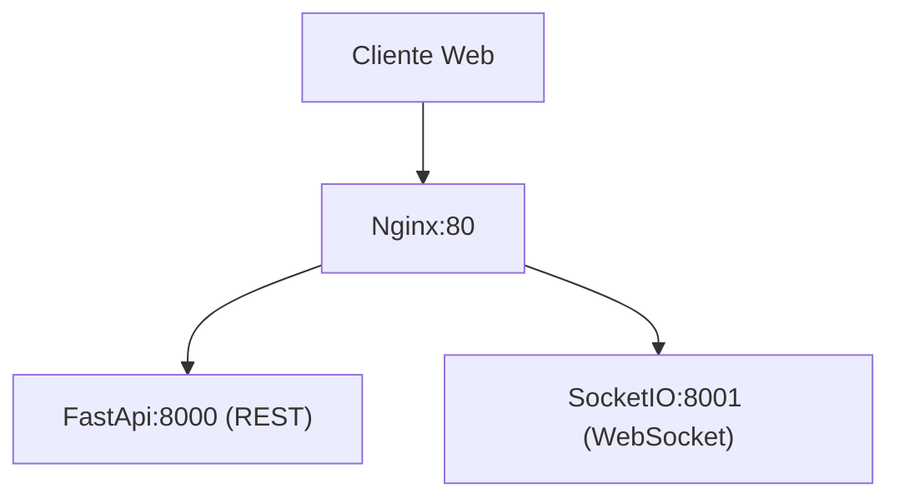
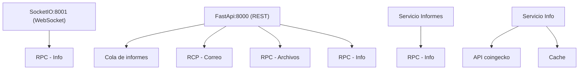
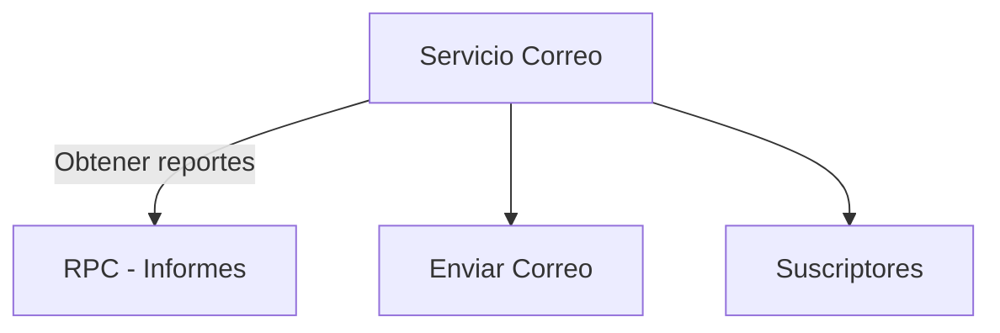
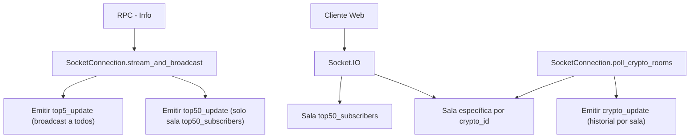
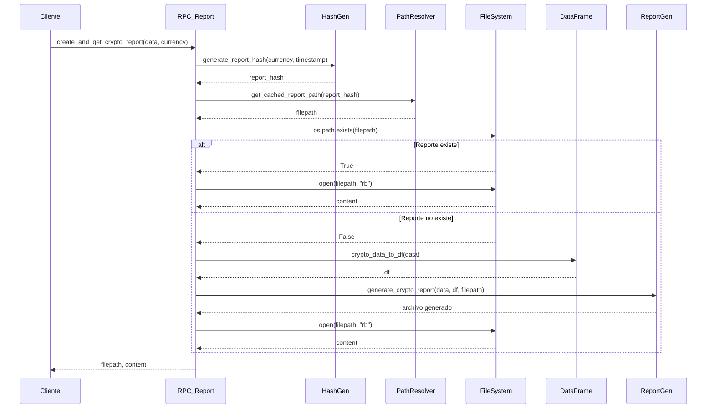
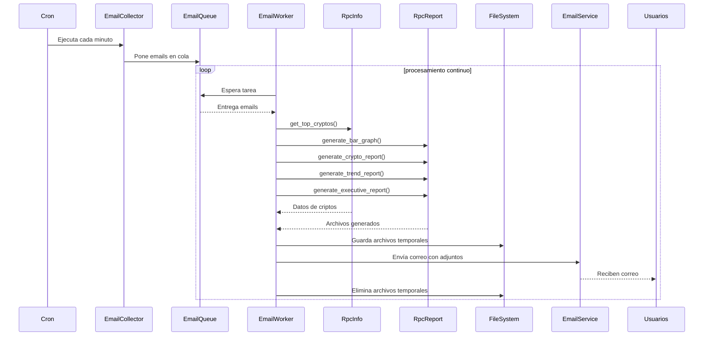

## 1. **Entrada del sistema**

- **Cliente Web**: El navegador del usuario que consume la aplicación.
- **Nginx:80**: Proxy inverso que enruta las peticiones HTTP y WebSocket.
- **FastAPI (REST)**: API principal que maneja peticiones HTTP.
- **SocketIO (WebSocket)**: Canal en tiempo real para actualizaciones de precios u otros eventos.

> Este bloque permite que el cliente se conecte a un solo punto (`Nginx`) y reciba tanto datos REST como eventos en tiempo real.

---

## 2. **Servicios RPC y procesamiento**

- **RPC - Info**: Servicio que consulta datos de criptomonedas (API coingecko).
- **RPC - Archivos**: Servicio que gestiona archivos generados (PDF, EXCEL, WORD, PNG).
- **RPC - Correo**: Servicio que prepara informes y los envía por email.
- **Cola de informes**: Sistema de tareas en background para generar reportes.
- **Servicio Informes**: Encargado de procesar solicitudes de informes.
- **Servicio Info**: Encargado de obtener datos externos (usando la API de CoinGecko) y almacenarlos en caché.

> Este bloque representa la lógica de negocio distribuida, donde cada servicio tiene una responsabilidad clara y se comunica por RPC.

---

## 3. **Servicio de correo**

- **Servicio Correo**: Orquestador que solicita reportes y los envía por email.
- **RPC - Informes**: Punto de acceso para obtener reportes generados.
- **Enviar Correo**: Módulo que realiza el envío real.
- **Suscriptores**: Base de datos o lista de destinatarios.

> Este bloque automatiza la distribución de reportes a usuarios suscritos.

---

## Diagrama de difusión

---

### 1. **stream_and_broadcast**
- Se conecta al stream RPC (`Info`) que envía actualizaciones periódicas del top 50.
- Emite dos eventos:
  - `top5_update`: se envía a **todos los clientes conectados**.
  - `top50_update`: se envía **solo a los clientes en la sala `top50_subscribers`**.
- Actualiza el caché local (`cached_top5`, `cached_top50`) para respuestas rápidas.

### 2. **Salas específicas (`join_room`)**
- Los clientes pueden unirse a una sala por `crypto_id` para recibir actualizaciones específicas.
- Cuando hay usuarios activos en una sala, el método `poll_crypto_rooms` consulta el historial de precios y emite `crypto_update` a esa sala.

### 3. **Redis opcional**
- Si se configura `redis_url`, se usa `AsyncRedisManager` para compartir estado entre múltiples instancias del servidor.
- Esto permite escalar horizontalmente sin perder sincronización de eventos.

---

## Diagrama de secuencia: Estrategia de generación de reportes

---

- El flujo completo desde que el cliente solicita un reporte.
- Cómo se genera un hash único para identificar el reporte.
- Cómo se determina la ruta en caché.
- La bifurcación entre reutilizar un archivo existente o generar uno nuevo.
- La conversión de datos a `DataFrame` y la escritura del archivo.
- La lectura final del archivo para devolverlo al cliente.

---

- **Evita duplicación**: El hash asegura que no se generen reportes repetidos.
- **Optimiza recursos**: Reutiliza archivos si ya existen.
- **Modularidad**: Cada función tiene una responsabilidad clara y puede ser testeada por separado.
- **Escalable**: Puede extenderse fácilmente para otros formatos (PDF, Word, etc.) siguiendo el mismo patrón.

---

## Diagrama de secuencia: Generación y envío de reportes

---

- El ciclo completo desde que el **cron** dispara el colector.
- Cómo se **filtran y encolan** los correos.
- El procesamiento asíncrono con múltiples llamadas RPC en paralelo.
- La **generación de archivos**, su almacenamiento temporal y envío.
- La limpieza final del sistema.

---
