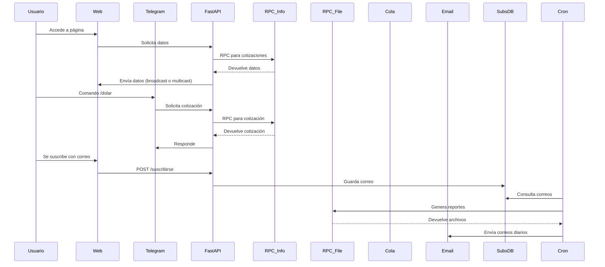

```mermaid
sequenceDiagram
  participant Usuario
  participant Web
  participant Telegram
  participant FastAPI
  participant RPC_Info
  participant RPC_File
  participant Cola
  participant Email
  participant SubsDB
  participant Cron

  Usuario->>Web: Accede a página
  Web->>FastAPI: Solicita datos
  FastAPI->>RPC_Info: RPC para cotizaciones
  RPC_Info-->>FastAPI: Devuelve datos
  FastAPI->>Web: Envía datos (broadcast o multicast)

  Usuario->>Telegram: Comando /dolar
  Telegram->>FastAPI: Solicita cotización
  FastAPI->>RPC_Info: RPC para cotización
  RPC_Info-->>FastAPI: Devuelve cotización
  FastAPI->>Telegram: Responde

  Usuario->>Web: Se suscribe con correo
  Web->>FastAPI: POST /suscribirse
  FastAPI->>SubsDB: Guarda correo

  Cron->>SubsDB: Consulta correos
  Cron->>RPC_File: Genera reportes
  RPC_File-->>Cron: Devuelve archivos
  Cron->>Email: Envía correos diarios
```